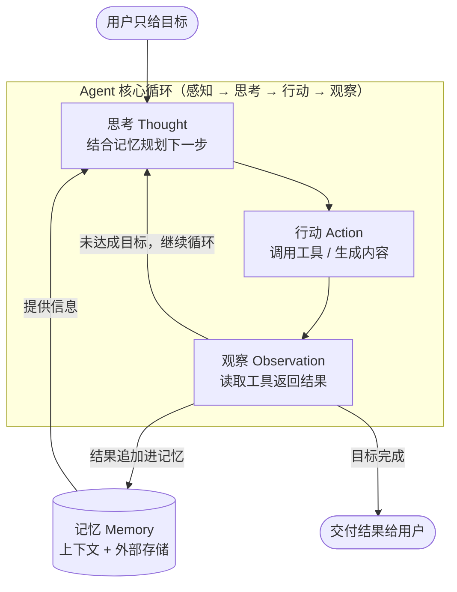

# Agent（智能体）

> **一句话定义：Agent 是以大模型为"大脑"，能够自主规划、调用工具并根据环境反馈迭代行动，直到完成用户目标的软件系统，而不只是一段"一问一答"的对话。**

## 1. 我的个人解释

我最初的误解是：Agent 就是"一个更聪明的聊天机器人"。学习之后发现，二者的根本区别在于**控制权在谁手里**。普通对话里，每一轮"做什么"都是我（用户）决定的：我提问、模型回答、我再决定下一步问什么——模型是被动的。而 Agent 是我把**目标**交出去，由它自己决定"先做什么、再做什么、要不要用工具、做完了没有"。

打个比方：大模型像一个**百科全书式的顾问**，你问它答，答完就结束；Agent 则像一个**能上网、能打电话、能动手的助理**——你说"帮我把这份表格整理好发给我同事"，它会自己拆任务：先读表格 → 发现格式问题 → 写脚本清洗 → 转换成要求的格式 → 发邮件，中间某一步报错了它还会换个方法重试。人只出现在起点（给目标）和终点（验收结果）。

所以判断一个东西是不是 Agent，我总结的口诀是：**看循环、看工具、看自主**——它是否处于"感知 → 思考 → 行动 → 观察结果 → 再思考"的循环里？是否会调用外部工具（搜索、代码执行、文件操作）？行动序列是它自己规划的还是人预先写死的？

## 2. 核心机制 / 组成

按照 Lilian Weng 的经典拆解（也是业界广泛引用的框架），一个 LLM 驱动的 Agent 由四大模块组成：

| 模块 | 作用 | 常见实现方式 |
|------|------|--------------|
| **LLM（大脑）** | 负责推理、决策、生成下一步动作 | GPT、Claude、GLM 等大语言模型 |
| **规划（Planning）** | 把大目标拆成可执行的子任务；对失败进行反思和重试 | 任务分解（task decomposition）、反思（Reflexion）、ReAct 的"想一步做一步" |
| **记忆（Memory）** | 提供知识支撑：短期记忆（当前上下文）+ 长期记忆（跨会话存储，通常靠向量数据库检索） | 上下文窗口 / RAG 检索外部记忆 |
| **工具使用（Tool Use）** | 弥补模型"只会说话"的短板，让它能真正操作外部世界 | 函数调用（Function Calling）、MCP、代码执行、搜索、文件读写 |

四大模块不是并列摆放，而是围绕一个**核心循环**协作。ReAct 论文（ICLR 2023）把这个循环提炼为"推理痕迹与行动交错"：每一步先写下"我在想什么、下一步做什么"，执行后观察结果，再决定下一步。下面这张图就是 Agent 的心跳：

Anthropic 在《Building Effective Agents》中进一步给出了一条**从简到繁的能力光谱**：增强型 LLM（带工具的单次调用）→ 工作流（Workflows，由代码预先编排好的固定流程）→ 自主 Agent（模型在循环中动态决定流程）。他们的核心建议是：**能用简单方案就别上复杂 Agent**——不是所有任务都值得付出 Agent 的延迟、成本和不确定性。

## 3. 具体应用场景

我在用 WorkBuddy 完成本次作业时，体验到的就是一个典型的 Agent 场景：

> 我只提出目标："完成这份 AI 概念学习作业，包含 Skill、三份学习资料、关系说明和 README，最后提交并 push 到 GitHub。"
> Agent（WorkBuddy）自主完成了整个流程：先 `ls` 查看仓库结构 → 读取已有 README 和 .gitignore → 上网检索并逐一验证参考链接 → 创建 SKILL.md、撰写三份学习资料和关系文档 → 更新 README 与 .gitignore → 最后执行 `git add / commit / push`。
> 中间每一步的"下一步做什么"都是它根据上一步的执行结果自己决定的。如果我用普通对话式 AI，就必须自己完成"检索、核对链接、写文件、敲 git 命令"，AI 只能给我文字建议。

其他典型场景：编程 Agent（如 Claude Code 自主修 bug、跑测试）、客服 Agent（自主查询订单、办理退换货）、数据分析 Agent（自主读取文件、清洗数据、画图）。

## 4. 易混淆问题与使用边界

**（1）Agent ≠ 大模型本身。** 大模型是 Agent 的"大脑"组件，但模型本身只会接收输入、生成输出，没有行动能力。Agent = 大模型 + 工具 + 规划循环。

**（2）Agent ≠ 工作流（Workflow）。** 工作流的步骤由开发者**预先编排**，确定性强、成本低；Agent 的步骤由模型**运行时自主决定**，灵活但不可完全预测。Anthropic 明确建议：任务简单、可预见时用工作流即可，只有"步骤数量无法预先确定、必须依赖模型判断"的任务才值得用自主 Agent。

**（3）Agent ≠ "多轮对话"。** 对话多轮 ≠ 自主决策。判断标准是每一轮之间的"衔接"是谁在控制——人在控制就只是对话，模型在控制才是 Agent。

**使用边界（什么时候不该用）：** 任务有固定明确流程（直接写普通程序更可靠）；对结果确定性要求极高、错误代价巨大（如直接执行不可逆的删除操作）；任务过于简单，一次模型调用就能解决。此外，Agent 的每一轮决策都消耗 token，成本和延迟会随循环次数放大。

## 5. 自测题

**Q1（单选）** 判断一个系统是不是 Agent，最关键的 标准 是：
A. 它的对话轮次很多
B. 它的**行动序列由模型在运行时自主决定**
C. 它接入了一个大语言模型
D. 它的回答非常流畅自然

**Q2（判断）** 一个由 Python 代码预先编排好步骤、中间调用了两次大模型做文本处理的流水线，是 Agent。（ ）

**Q3（简答）** 说出 Agent 的四大组成模块，并各举一个具体实现。

**Q4（简答）** 你要实现"每周一自动从数据库拉数、生成固定格式的周报"这个任务，该用 Agent 还是普通程序/工作流？为什么？

### 答案与解析

- **Q1 → B。** 控制权是本质判据：A、C、D 都是聊天机器人也可能满足的特征，只有"行动序列由谁决定"能区分 Agent 与对话/工作流（对应第 4 节第 (2)(3) 条易混淆点）。
- **Q2 → ✗。** 步骤由代码**预先编排**，这是工作流（Workflow）的定义；即使中间调用大模型，流程控制权也不在模型手里（对应"Agent ≠ 工作流"）。
- **Q3 →** LLM 大脑（如 GLM/Claude）、规划（如 ReAct 的"想一步做一步"）、记忆（如上下文窗口 + RAG 外部检索）、工具使用（如函数调用/MCP/代码执行）。
- **Q4 →** 应该用普通程序或工作流。任务步骤固定、数量可预先确定、无需模型临场判断，用 Agent 反而引入不必要的成本、延迟和不确定性——这正是 Anthropic "能用简单方案就别上复杂 Agent" 的适用边界。

## 6. 资料来源（均为一手来源，链接已于 2026-09-10 验证可达）

| # | 来源 | 类别 | 说明 |
|---|------|------|------|
| 1 | Lilian Weng（OpenAI 研究员）, 《LLM Powered Autonomous Agents》, 2023-06-23, https://lilianweng.github.io/posts/2023-06-23-agent/ | 知名研究者一手技术博客 | 本文"核心机制/组成"（规划、记忆、工具使用）的框架出处 |
| 2 | Yao et al., 《ReAct: Synergizing Reasoning and Acting in Language Models》, ICLR 2023（arXiv:2210.03629）, https://arxiv.org/abs/2210.03629 | 学术论文（顶会录用） | "思考-行动-观察"核心循环与机制图的原始出处 |
| 3 | Anthropic, 《Building Effective Agents》, 2024-12-19, https://www.anthropic.com/research/building-effective-agents | 官方一手工程博客 | "能力光谱（增强型 LLM → 工作流 → Agent）"与"何时不该用 Agent"的出处 |
| 4 | WorkBuddy 官方文档, https://www.workbuddy.cn/docs/workbuddy/Overview | 官方文档 | 佐证第 3 节的应用场景：WorkBuddy 的"自主规划执行、多步骤复杂任务"描述 |

## 7. 自检报告

对照 `concept-learning` Skill 自检清单逐项核查（2026-09-10）：

| 检查项 | 结果 | 证据 |
|--------|------|------|
| 个人解释无照抄 | ✅ | 三段均为第一人称消化后的表述与自创比喻（"顾问 vs 助理"），与来源原文表述不同 |
| 机制完整 | ✅ | 定义中的"大脑/自主规划/调用工具/反馈迭代"分别对应表格四模块与循环图 |
| 图示正确 | ✅ | Mermaid 为标准 flowchart 语法，图中"思考/行动/观察/记忆"与第 2 节表格及 ReAct 论文描述一一对应，无多余组件 |
| 场景具体 | ✅ | 第 3 节场景含时间（本次作业）、人物（我）、动作（八步流程）、结果（push 成功） |
| 边界清晰 | ✅ | 指出 3 个易混淆概念并逐一说明区别 |
| 自测题有效 | ✅ | 4 道题全部命中第 4 节易混淆点，答案与正文一致，无送分背诵题 |
| 来源合规 | ✅ | 4 条来源均属白名单（研究者一手博客 / 顶会论文 / 官方工程博客 / 官方文档），URL 验证日期见第 6 节，均支撑文中相应论述 |
| 安全合规 | ✅ | 全文无密钥、密码、个人隐私 |
