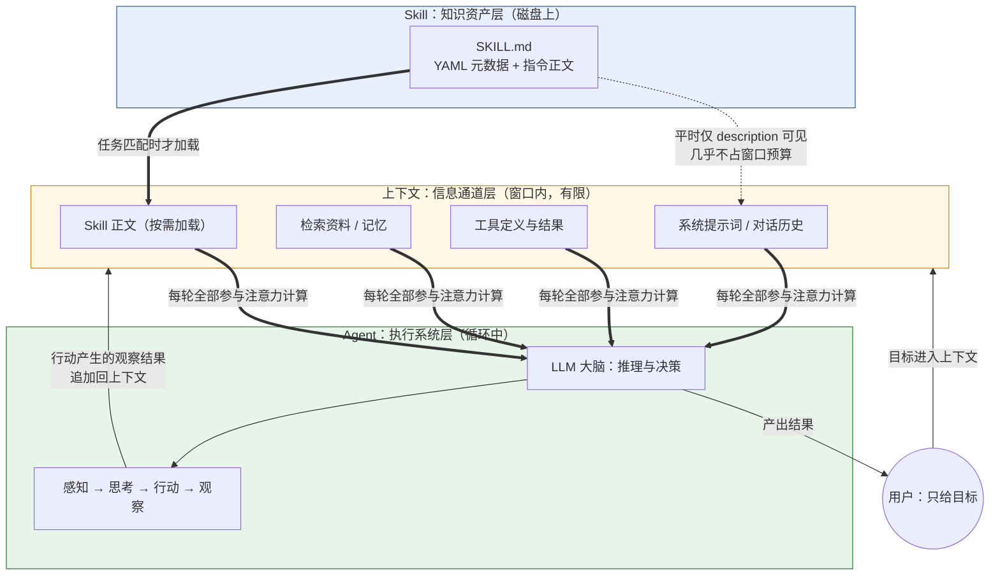
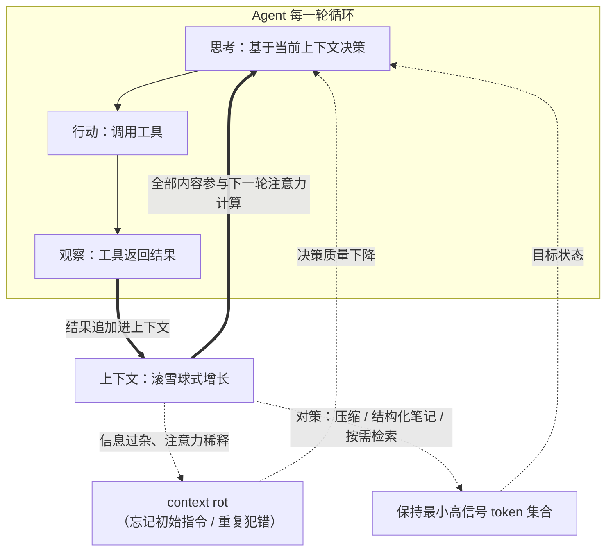
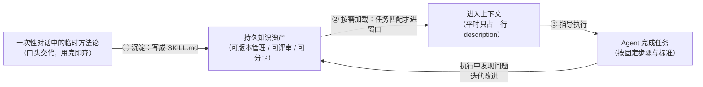

# 概念关系说明：Agent、大模型的上下文、Skill

> 本文说明三个概念之间的关系，重点回答两个问题：**上下文如何影响 Agent 的工作**，以及 **Skill 如何沉淀可复用的任务知识**。全文配 1 张总览图 + 2 张专题图，一图只说一件事。

## 一、三个概念的定位

先用一句话把三者的角色分开：

- **Agent**：一个**运行着的系统**（模型 + 规划 + 记忆 + 工具，处于"感知→思考→行动"循环中）；
- **大模型的上下文**：Agent 的**工作内存**——Agent 每一步推理的唯一信息来源，也是稀缺资源；
- **Skill**：一份**静态的知识资产**（SKILL.md 文件），只有被 Agent 加载后才参与工作。

三者不是并列的同类概念，而是一个系统里的**三个层次**：Skill 是知识，上下文是通道，Agent 是执行者。

## 二、总览图：知识（Skill）→ 通道（上下文）→ 行动（Agent）

图例：虚线 = 元数据层面的轻量连接；粗箭头 = 信息注入上下文；细箭头 = 控制流与数据流。

## 三、对照表

| 维度 | Agent | 大模型的上下文 | Skill |
|------|-------|----------------|-------|
| **本质** | 运行中的系统 | 一次推理的全部输入信息 | 磁盘上的指令文件 |
| **类比** | 能干的助理 | 助理的桌面 / 工作内存 | 助理的操作手册 |
| **生命周期** | 会话期间持续运行 | 每轮推理重建、会话结束即消失 | 持久化，可版本管理、可分享 |
| **谁控制** | 模型自主决策 | 由上下文工程管理其内容 | 开发者/用户编写 |
| **典型问题** | 何时该用、何时用工作流 | 窗口溢出、context rot | 何时该做、何时该改 |
| **三者关系** | 执行者 / 消费方 | 通道 / 瓶颈 | 弹药库 / 供给方 |

## 四、专题一：上下文如何影响 Agent 的工作

**上下文是 Agent 的"视野边界"——模型看不见上下文之外的一切。** 这带来三层影响：

1. **决定 Agent 能"知道"什么。** 大模型本身是无状态的，Agent 的规划、工具选择、下一步动作，全部基于当轮上下文里的内容。历史对话、工具返回结果、检索资料，都必须进入上下文才对 Agent 有效。这决定了 Agent 系统必须围绕"往上下文里放什么"来做设计。

2. **上下文质量直接决定决策质量。** Agent 每完成一步，工具返回的结果都会追加进上下文，滚雪球式增长。信息越积越多、越来越杂，注意力被稀释，就会出现"context rot"：关键信息淹没在无关细节里，Agent 开始"忘记"最初的指令、重复犯错、抓不住重点。

3. **上下文是 Agent 的成本与瓶颈。** 每轮循环都要重新处理整个上下文，token 消耗和延迟随任务复杂度放大；窗口写满就意味着任务被截断。所以成熟的 Agent 把"控制进入窗口的信息量"当作一等大事——这也是 Skill 采用"按需加载"设计的直接原因。

滚雪球过程与对策如下图：

一句话：**Agent 的能力强弱，一半取决于模型，一半取决于上下文经营得好不好**（Anthropic 的压缩、结构化笔记、just-in-time 检索即为此而生）。

## 五、专题二：Skill 如何沉淀可复用的任务知识

**Skill 的本质，是把"只存在于某次对话里的方法论"变成"独立于对话存在的资产"。** 具体机制有三步：

1. **沉淀**：把一类任务的完整做法（适用场景、步骤、输出结构、自检标准）写成 SKILL.md。它天然带版本管理（随 Git 仓库走）、可评审、可分享——这正是"知识资产"区别于"口头交代"的地方。

2. **按需注入**：Skill 平时只暴露一行 description（几乎不占上下文），当 Agent 判断当前任务匹配时，才把正文加载进上下文。**这意味着 Skill 与上下文之间存在一道精心设计的闸门**：知识常驻磁盘而非上下文，既让 Agent 拥有一个可以很大的"外置知识库"，又不加重平时的上下文负担。这是对第四节"上下文稀缺"问题的直接回应。

3. **复用**：加载后的 Skill 以指令形式参与 Agent 的推理，指导它调用工具、组织产出；同一份 Skill 可以被无数次的任务、不同的使用者（clone 仓库的同学）、甚至不同的 AI 工具（开放标准）重复使用。

## 六、三者协同的一次完整旅程

以本次作业为例，串起三个概念：

> 我对 WorkBuddy（一个 **Agent**）说："完成概念学习作业。"
> Agent 根据各 Skill 的 description 判断任务与 `concept-learning` 匹配，把该 **Skill** 的正文加载进**上下文**；从这一刻起，Agent 的每一步推理（检索资料、验证链接、绘制机制图、按固定结构撰写、自测与自检）都在这份方法论的指导下进行，同时它的中间结果（文件内容、命令输出）也不断追加进上下文，作为下一步决策的依据。
> 最终 Agent 产出的不仅是三份作业，还多了一项副产品——下次任何概念的学习任务，都可以直接复用这个 Skill。

**总结成一句话：Agent 是执行者，上下文是它每一步推理所依据的"视野"，Skill 是可以随时装进这份视野的、沉淀好的方法论——三者构成"知识（Skill）→ 通道（上下文）→ 行动（Agent）"的完整链路。**
