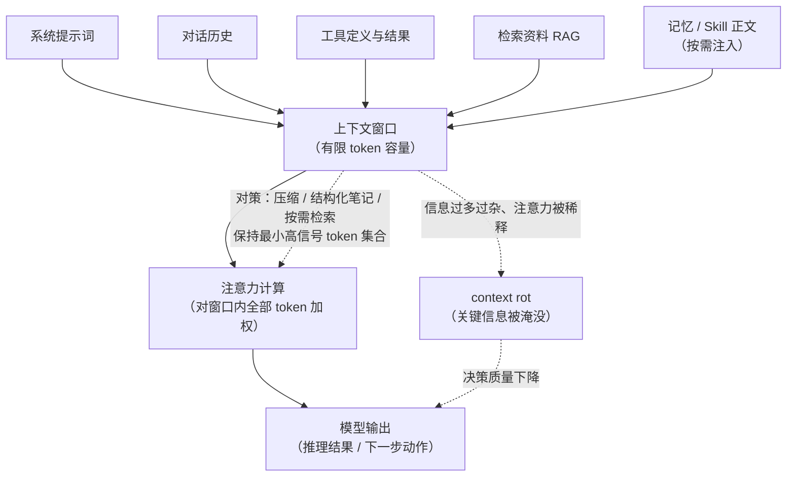

# 大模型的上下文（Context）

> **一句话定义：上下文是大模型在处理当前请求时能"看见"的全部信息——包括系统指令、对话历史、检索到的资料、工具返回的结果，它是模型做决策的唯一依据，也是一份会被用完的稀缺资源。**

## 1. 我的个人解释

我开始以为"上下文"就是"聊天记录"，学完发现它比聊天记录宽得多，也**金贵**得多。

宽在**范围**：大模型是无状态的——它每次推理只依赖这一次输入的 token 序列。这个序列里装的东西就是上下文：系统提示词（告诉它你是谁、规则是什么）、历史对话、用户当前的问题、从外部检索来的资料、工具调用返回的结果……凡是希望模型"知道"的信息，都必须塞进这一份上下文里，塞不进去的就等于不存在。

金贵在**容量与注意力**：上下文窗口有长度上限（以 token 计），而且**不是越大越好**。Anthropic 的工程博客里有个说法让我印象很深：要把上下文当作"有限的资源"来做工程化管理，目标是"找到能最大化实现预期结果的最小高信号 token 集合"。因为模型每一轮循环都会把积累的上下文重新读一遍，信息越多越杂，注意力就越被稀释，甚至出现"上下文腐化（context rot）"——关键信息淹没在无关细节里，模型表现反而下降。《Lost in the Middle》论文也实证了这一点：长文本中间的信息，模型经常"看不见"。

打个比方：上下文就是模型的**书桌桌面**。桌面面积有限（窗口上限），桌上堆的东西都要在眼皮底下（注意力）；把整个仓库都搬到桌面上，反而找不到要用的那支笔。会收拾桌面，比有张大桌子更重要。

## 2. 核心机制 / 组成

对一次 Agent 会话而言，上下文主要由以下几个部分组成（每个部分都占用窗口预算）：

| 组成 | 内容 | 来源 |
|------|------|------|
| **系统提示词** | 角色设定、规则、输出格式约定 | 开发者/平台预先配置 |
| **对话历史** | 之前的用户消息与模型回复 | 会话累积 |
| **工具定义与结果** | 可用工具的说明文档 + 每次工具调用返回的内容 | 工具系统 |
| **检索资料** | RAG 召回的文档片段、网页内容 | 外部知识库 |
| **记忆** | 跨会话注入的长期记忆摘要 | 记忆系统 |

围绕上下文有三个关键机制：

1. **注意力机制（Attention）**：Transformer 的核心。模型在生成每个 token 时对上下文中所有 token 计算权重，"关注"相关信息——这是上下文能被利用的底层原理（《Attention Is All You Need》）。
2. **上下文窗口（Context Window）**：模型单次能处理的最大 token 数。超出就要截断、压缩或丢弃。
3. **上下文工程（Context Engineering）**：把上下文当有限资源来经营的一整套方法——Anthropic 总结了压缩（compaction，把冗长历史摘要成短文）、结构化笔记（sub-agent 只回传结论而非过程）、按需检索（just-in-time，用时才取）等手段，核心就是控制进入窗口的信息"少而准"。

五个组成部分如何汇入窗口、注意力如何消费它们、以及信息过杂时的后果，一图看懂：

## 3. 具体应用场景

一个我亲历的场景：让 AI 助手（Agent）帮我分析仓库里的代码。

> 仓库有几十个文件，而模型上下文窗口装不下所有代码。助手采取的做法是：先用 `ls`/Glob 只看目录结构 → 用 Grep 检索关键词定位相关文件 → 只把**命中的 2~3 个文件**读进上下文 → 给出分析结论。
> 整个过程中，"决定哪些信息进入上下文"本身就是 Agent 的核心工作。如果它把所有文件一股脑读进来，不仅浪费 token，还会因为无关代码干扰而降低分析质量。

其他典型应用：RAG 检索增强问答（把外部知识"按需"注入上下文）、对话摘要压缩（长对话定期摘要，保留关键信息释放窗口）、Claude Code 的 Skills 机制（技能正文只在被使用时才加载，平时几乎不占用 token）。

## 4. 易混淆问题与使用边界

**（1）上下文 ≠ 上下文窗口。** 上下文是"内容"（本次推理输入的全部信息）；上下文窗口是"容量"（能装多少 token）。内容必须装进窗口里。

**（2）上下文记忆 ≠ 长期记忆。** 上下文是**会话内**的短期记忆，会话结束（或被压缩）就消失；模型的**参数知识**（训练时学到的）才是长期的。模型"知道"分两类：参数里固化的知识 + 本次上下文临时注入的信息。让模型"记住"新东西，要么靠下次继续注入，要么微调参数——上下文本身不能持久。

**（3）上下文工程 ≠ 提示词工程。** 提示词工程优化"你发给模型的那句话"；上下文工程优化的是**整个信息集合的构成与管理**——哪些信息进窗口、何时进、以什么形式进、满了解决什么，是更上层的系统性工作（这也是 2025 年前后业界从"prompt engineering"转向"context engineering"的原因）。

**使用边界：** 不要迷信"窗口大就随便塞"。实验表明模型对超长上下文中间部分的信息利用率显著偏低（Lost in the Middle）；上下文也不适合当作数据库来"存"信息——它是工作内存（类似内存），不是持久存储（类似硬盘）。

## 5. 自测题

**Q1（单选）** "上下文"和"上下文窗口"的关系，正确的说法是：
A. 两个词是同义词
B. 窗口是**容量**（最多装多少 token），上下文是**内容**（本次实际输入的全部信息）
C. 上下文存在窗口里，窗口存在上下文里
D. 窗口是永久的，上下文是临时的

**Q2（判断）** 模型的上下文窗口越大，把所有相关不相关的资料都塞进去，回答质量一定越好。（ ）

**Q3（简答）** 模型"知道"的知识分哪两大类？各自如何获得、如何失效？上下文属于哪一类？

**Q4（简答）** 什么是 context rot？说出至少两种上下文工程给出的对策。

<b>答案与解析（先自己作答，再点击展开）</b>

- **Q1 → B。** 内容与容量的关系，装不下就要截断/压缩（对应第 4 节第 (1) 条易混淆点）。
- **Q2 → ✗。** 两个反例：Lost in the Middle 实证了长文本中间位置的信息利用率显著偏低；Anthropic 指出信息过多过杂会稀释注意力、引发 context rot——目标是"最小高信号 token 集合"而不是"全塞进去"。
- **Q3 →** 参数知识（训练时固化进权重，长期存在，靠微调更新）+ 上下文知识（本次推理临时注入，会话结束即消失）。上下文属于第二类，所以它不能当长期记忆用。
- **Q4 →** context rot 指上下文积累过多过杂后，注意力被稀释、关键信息被淹没、模型表现下降的现象。对策：压缩（把冗长历史摘要成短文）、结构化笔记（子 Agent 只回传结论不回传过程）、按需检索（just-in-time，用到时才取）。

## 6. 资料来源（均为一手来源，链接已于 2026-09-10 验证可达）

| # | 来源 | 类别 | 说明 |
|---|------|------|------|
| 1 | Anthropic, 《Effective context engineering for AI agents》, 2025-09-29, https://www.anthropic.com/engineering/effective-context-engineering-for-ai-agents | 官方一手工程博客 | "上下文是有限资源""最小高信号 token 集合""context rot"及压缩/结构化笔记/子代理等机制的出处 |
| 2 | Liu et al., 《Lost in the Middle: How Language Models Use Long Contexts》, 2023（arXiv:2307.03172，TACL 2023 录用）, https://arxiv.org/abs/2307.03172 | 学术论文（期刊录用） | "长文本中间信息利用率下降"的实证依据 |
| 3 | Vaswani et al., 《Attention Is All You Need》, 2017（arXiv:1706.03762，NeurIPS 2017）, https://arxiv.org/abs/1706.03762 | 学术论文（顶会） | 注意力机制的原始论文，"模型如何利用上下文"的底层原理出处 |
| 4 | Claude Code 官方文档, Skills 页面, https://code.claude.com/docs/en/skills | 官方文档 | "技能正文只在使用时加载、平时不消耗 token"的实例佐证 |

## 7. 自检报告

对照 `concept-learning` Skill 自检清单逐项核查（2026-09-10）：

| 检查项 | 结果 | 证据 |
|--------|------|------|
| 个人解释无照抄 | ✅ | "书桌桌面"比喻与三段第一人称表述均为消化后自创 |
| 机制完整 | ✅ | 定义中"全部信息/唯一依据/稀缺资源"分别对应五组成分表、注意力机制、窗口容量三部分 |
| 图示正确 | ✅ | Mermaid 图中五个信息来源与第 2 节成分表一一对应（第五个来源"记忆 / Skill 正文"对应表中"记忆"一行，Skill 正文为其按需注入的实例），"压缩/笔记/按需检索"三个对策与正文第 3 条机制一致，无多余组件 |
| 场景具体 | ✅ | 第 3 节场景含动作（ls/Grep/读取 2~3 个文件）、结果（结论质量对比） |
| 边界清晰 | ✅ | 指出 3 组易混淆概念（窗口/长期记忆/提示词工程）并说明区别 |
| 自测题有效 | ✅ | 4 道题分别命中 3 个易混淆点 + context rot 机制，答案与正文一致 |
| 来源合规 | ✅ | 4 条来源均属白名单（官方工程博客 / 学术论文×2 / 官方文档），验证日期见第 6 节 |
| 安全合规 | ✅ | 全文无密钥、密码、个人隐私 |
