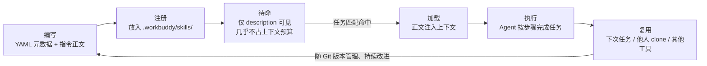

# Skill（技能）

> **一句话定义：Skill 是一个把"做某类任务的完整方法"沉淀成结构化指令文件（SKILL.md）的机制，AI 助手在遇到相应任务时才加载它并按其中步骤执行，从而把一次性经验变成可复用、可分享的能力。**

## 1. 我的个人解释

我理解 Skill 的最好方式是把它和"给新同事的交接文档"类比。

你第一次教 AI 做某件事（比如"生成一份概念学习资料"），可能要在对话里临时说一大堆要求："先查资料、来源要验证、要有个人解释、要有易混淆问题……"。下次再做同类任务，这些话还得重说一遍——相当于每次都给新同事口头交代一遍。**Skill 就是把这些交代写成一份固定的《岗位操作手册》放进工具箱**：AI 助手自己判断当前任务和手册匹配时自动翻开来照着做；也可以由用户直接点名调用（如 `/concept-learning`）。

它解决的核心痛点是：**重复劳动 + 知识不沉淀**。Claude Code 文档给了一个很实在的判断信号——"当你发现自己反复粘贴同一段指令、同一个检查清单、同一套多步骤流程时，就该把它做成 Skill 了"。

Skill 最巧妙的一点在于它对**上下文**的尊重：手册平时安安静静躺在磁盘里，几乎不占用模型的上下文窗口；只有任务匹配时才把正文加载进来。也就是说，它是"按需装载的知识"，而不是"常驻内存的负担"——这点和 Agent 的上下文管理直接呼应。

## 2. 核心机制 / 组成

一个 Skill 在结构上是"**一个文件夹 + 一个 SKILL.md**"，SKILL.md 由两部分组成：

| 组成 | 内容 | 作用 |
|------|------|------|
| **YAML 元数据（frontmatter）** | 至少包含 `name` 和 `description` | 让 AI 在不加载正文的情况下就能判断"这个 Skill 和当前任务是否相关"；还可配置允许的工具等 |
| **Markdown 指令正文** | 适用场景、输入、生成步骤、输出结构、资料来源要求、自检要求等 | 任务匹配时被加载进上下文，AI 按此执行 |

工作机制的四个关键环节：

1. **注册**：Skill 文件放在约定路径（项目级放在 `.workbuddy/skills/<名称>/SKILL.md`），系统扫描后注册进 AI 的能力清单。
2. **匹配**：AI 读取各 Skill 的 `description`（此时不消耗正文 token），判断当前任务是否命中。
3. **加载**：命中后把 SKILL.md 正文注入上下文，AI 按其中的步骤、输出结构执行任务。
4. **复用与分享**：同一份 Skill 可反复使用，可随仓库分享给他人（Claude Code 的 Skills 还遵循 agentskills.io 开放标准，可跨 AI 工具通用）。

按存放位置分为两级：**项目级**（`<项目>/.workbuddy/skills/`，团队共享，随仓库走）和**用户级**（`~/.workbuddy/skills/`，个人跨项目通用）。

一个 Skill 从编写到复用的完整生命周期：

注意图中"待命"一环：平时外界只能看到一行 `description`，这正是 Skill 与上下文之间那道**按需加载的闸门**。

## 3. 具体应用场景

本仓库就是最直接的场景：

> 本次作业要求"为三个概念生成学习资料，且不能只为这三个概念写一次性提示词"。为此我在 `.workbuddy/skills/concept-learning/SKILL.md` 中沉淀了一个通用的概念学习 Skill：它定义了接收**任意**新概念（RAG、MCP、LoRA……都行）时的完整流程——检索资料 → 交叉验证 → 费曼式个人解释 → 按固定结构撰写 → 绘制机制图 → 编制自测题 → 验证来源 URL → 自检与双重审查。**并且它通过了通用性实测**：用"RAG"这个全新概念实际走了一遍 8 步流程，每一步均可执行（实测记录见 README）。
> 下学期我再选一门课，遇到"给 N 个新概念写学习笔记"的作业，直接在 WorkBuddy 里说一句"用 concept-learning 这个 Skill 学习 XX 概念"，不必重新交代任何方法论；同学 clone 了这个仓库，也能直接复用同一套流程。

其他典型场景：团队把"发布上线前检查清单"做成 Skill（每次执行发布任务时自动走一遍）；把"写周报的固定格式与措辞规范"做成 Skill（周报质量稳定且不再口口相传）。

## 4. 易混淆问题与使用边界

**（1）Skill ≠ 提示词（Prompt）。** 提示词是**一次对话中**的临时指令，用完即弃；Skill 是**持久化、结构化、带元数据**的方法论文件，可版本管理、可复用、可分享。可以把 Skill 理解为"被产品化了的可复用提示词 + 执行流程"。

**（2）Skill ≠ 工具（Tool）。** 工具是 AI 的"手"——能执行的具体动作（搜索、读写文件、发邮件）；Skill 是"操作手册"——指导 AI 如何组合工具、按什么步骤和标准完成任务。Skill 本身不提供新动作，只提供方法。Claude Code 文档的表述是"把 Skill 加入 AI 的工具箱（toolkit）"，指能力层面的扩展。

**（3）Skill ≠ Agent。** Agent 是运行着的系统（模型 + 循环 + 工具）；Skill 是静态的知识资产，只有在被 Agent 加载使用时才发挥作用。二者关系是：Skill 让 Agent 变得更专业。

**使用边界：** 一次性的、不再重复的任务不值得做成 Skill（直接对话即可）；不断变化、尚未稳定的方法论也不宜过早固化成 Skill（否则每次都要改）；涉及机密信息的流程要注意 Skill 会随仓库分享传播，敏感内容不得写入。另外，Anthropic 在官方公告中提醒：Skills 可能包含可执行脚本，**只应使用来自可信来源的技能**。

## 5. 自测题

**Q1（单选）** Skill 与一次性提示词最本质的区别是：
A. Skill 的字数更多
B. Skill 是**持久化、结构化、可版本管理、可复用分享**的文件，提示词用完即弃
C. Skill 只能由程序员编写
D. Skill 必须联网才能使用

**Q2（判断）** 给 AI 安装一个 Skill 之后，AI 就获得了一个新的执行动作（比如直接调用某个新 API）。（ ）

**Q3（简答）** 为什么说 Skill 的"按需加载"设计是对上下文这种稀缺资源的尊重？如果 Skill 正文常驻上下文，会发生什么？

**Q4（简答）** 出现什么信号时说明该把一段流程做成 Skill？举一个**不该**做成 Skill 的例子。

<b>答案与解析（先自己作答，再点击展开）</b>

- **Q1 → B。** 持久化/结构化/可复用是 Skill 的三大特征，A、C、D 均不构成本质区别（对应第 4 节第 (1) 条易混淆点）。
- **Q2 → ✗。** Skill 提供的是**方法和流程**（怎么组合现有工具），不提供新的执行动作——新动作属于"工具"的职责，二者是"操作手册"与"手"的关系。
- **Q3 →** 上下文是有限且会随杂乱信息退化的稀缺资源（窗口上限 + context rot）。Skill 平时只暴露一行 description，几乎不占预算；正文常驻则会白白挤占窗口、稀释注意力，任务没来就先付了"上下文税"。
- **Q4 →** 信号：反复粘贴同一段指令/检查清单/多步骤流程（Claude Code 文档原文给出的判据）。不该做的例子：一次性的、不再重复的任务（如"帮我给这封邮件起个标题"）——做完就不会再用，固化成 Skill 只是浪费维护成本。

## 6. 资料来源（均为一手来源，链接已于 2026-09-10 验证可达）

| # | 来源 | 类别 | 说明 |
|---|------|------|------|
| 1 | Claude Code 官方文档, Skills 页面, https://code.claude.com/docs/en/skills | 官方文档 | Skill 的定义（"创建 SKILL.md 即扩展能力"）、结构（YAML frontmatter + 指令正文）、"反复粘贴同样指令时该做 Skill"信号、"正文仅使用时加载、平时不耗 token"、agentskills.io 开放标准 |
| 2 | Anthropic（Claude 官方博客）, 《Agent Skills》发布公告, 2025-10-16（2025-12-18 更新）, https://claude.com/blog/skills | 官方一手公告 | Skill 四大特性（可组合、可移植、按需高效加载、支持可执行代码）、"仅使用可信来源的技能"安全提醒、开放标准发布 |
| 3 | Agent Skills 开放标准, https://agentskills.io | 开放标准官网 | Skill 作为跨 AI 工具的开放标准，说明其可移植性 |
| 4 | WorkBuddy 官方文档, https://www.workbuddy.cn/docs/workbuddy/Overview | 官方文档 | 佐证项目级/用户级 Skill 的存放路径约定及在 AI 助手中调用的方式 |

## 7. 自检报告

对照 `concept-learning` Skill 自检清单逐项核查（2026-09-10）：

| 检查项 | 结果 | 证据 |
|--------|------|------|
| 个人解释无照抄 | ✅ | "交接文档/操作手册"类比与第一人称表述均为自创 |
| 机制完整 | ✅ | 定义中"沉淀成结构化文件/按需加载/可复用"分别对应结构表、生命周期图"待命→加载"环节、复用环节 |
| 图示正确 | ✅ | Mermaid 生命周期图的"编写/注册/待命/加载/执行/复用"六环节与第 2 节四个关键环节及两级存放说明一一对应 |
| 场景具体 | ✅ | 第 3 节以本仓库 concept-learning Skill 为例，含 RAG 通用性实测结果（详见 README 实测记录） |
| 边界清晰 | ✅ | 指出 3 个易混淆概念（提示词/工具/Agent）并说明区别，另补官方安全边界提醒 |
| 自测题有效 | ✅ | 4 道题分别命中"Skill≠提示词""Skill≠工具""按需加载与上下文""何时该做/不该做" |
| 来源合规 | ✅ | 4 条来源均属白名单（官方文档×2 / 官方公告 / 开放标准官网），验证日期见第 6 节 |
| 安全合规 | ✅ | 全文无密钥、密码、个人隐私 |
